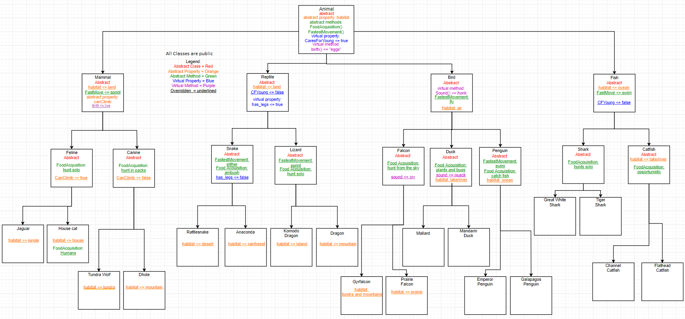
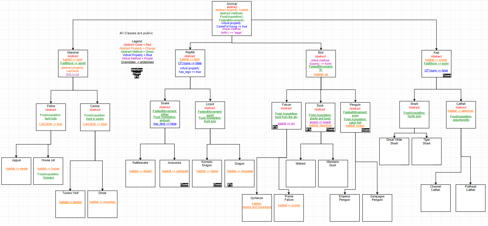

# Lab05_OOP_Principles

## Introduction  
Here we have the zoo of the mostly ordinary and exotic!  
Here we show the application of Object Oriented Programming (OOP) in C#.  
The zoo is made up of animals who are different species; falling into different families.  
For example, a common house cat is a feline; a feline is a mammal, and a mammal is an animal.  
Anyways, enjoy your visit to the zoo of mostly ordinary and exotic!  
Oh, be careful of the dragon, it is our only exotic and watch out for its fire breath!  

## Visual  
Here is a digital drawing showing how each animal is related to one another.  
  

## Documentation
Object Oriented Programming (OOP) Principles:  
1. Inheritance  
	- This allows for other classes to take properties and methods from another class.  
	- It creates the ability for base (parent) and derived (children) classes.  
	- An example of this using the snake class would be how rattlesnake is derived from snake while reptile is the base for snake.  

2. Abstraction  
	- An abstract class is like a template for a class
	- It is an abstract class because there isn't enoguh information for it to be a concrete class
	- An example of abstraction is how the feline class can't be defined without more information but it serves as a template for a jaguar.

3. Polymorphism
	- This is the ability to change what a class inherits from another class.  
	- Four keywords for polymorphism would be: abstract, virtual, override and sealed  
		- Abstract methods and properties (not classes) are not declared in the class it is created  
			- Abstract methods must be declared at least before the first concrete (non-abstract) class  
		- Virtual methods and properties are defined at creation but can be changed in derived classes.
		- Override is what allows you to change the methods or properties that have been inherited
		- Sealed makes it so that classes derived from the current class can not override the method or property.
	- An example of polymorphism is how Mammals have the Birth() method derived from the Animal class
		- The Birth() starts as "eggs" but in Mammals it is overridden to be "live".

4. Encapsulation
	- This is the ability to determine who has access to the code.
	- This is done through one of five access modifiers added to the start of the method signature.
		1. Public
			- This allows anyone to have access to the code.
			- This is the modifier that I used on all of my classes, properties, and methods
		2. Private
			- This is the default modifier for C#
			- This only lets the class have access to it.
		3. Protected
			- This lets the class and its derived classes have access to it.
		4. Internal
			- This lets any classes within the project (sln file) have access to it.
		5. Protected Internal
			- This lets any classes within the project and any derived classes from the project have access to it.

# Lab06: Interfaces

## Interface
An interface defines what an object can do. It usually entails actions of an object.  
For a class to use an interface, it must implement everything in the interface.  

## My Implementations
I had 2 interfaces, ISwim and IFly.  
As their name tells, ISwim is for swimming while IFly is for flying.  
ISwim is being implemented by the classes (and their derivative if they have one): Anaconda, Komodo Dragon, Duck, Penguin, and Fish.  
	ISwim is being implemented in these classes because all these animals can swim.  
IFly is being implemented by the classes (and their derivative if they have one): Dragon, Falcon, and Duck.  
	IFly is being implemented in these classess because all of these animals can fly in the air.  

## Visual with Interfaces
Here is a digital diagram of the animals again but this time it has interfaces  
